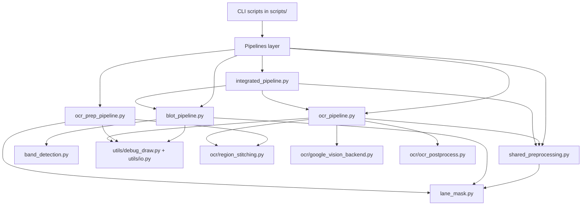
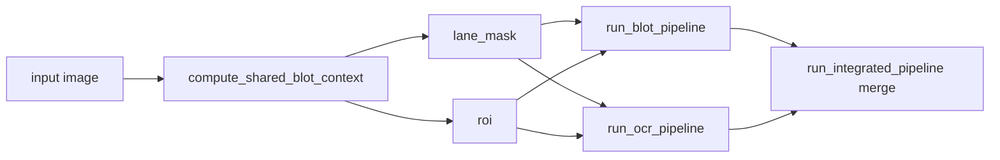
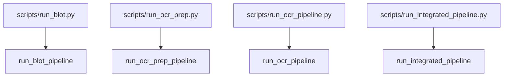
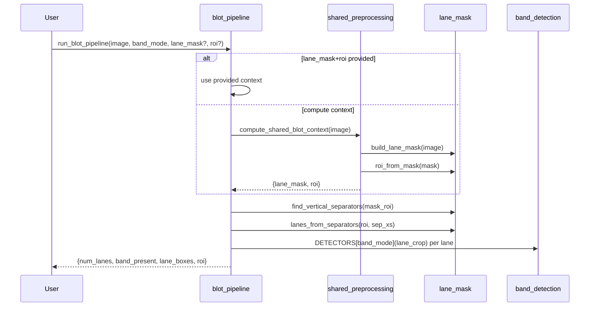
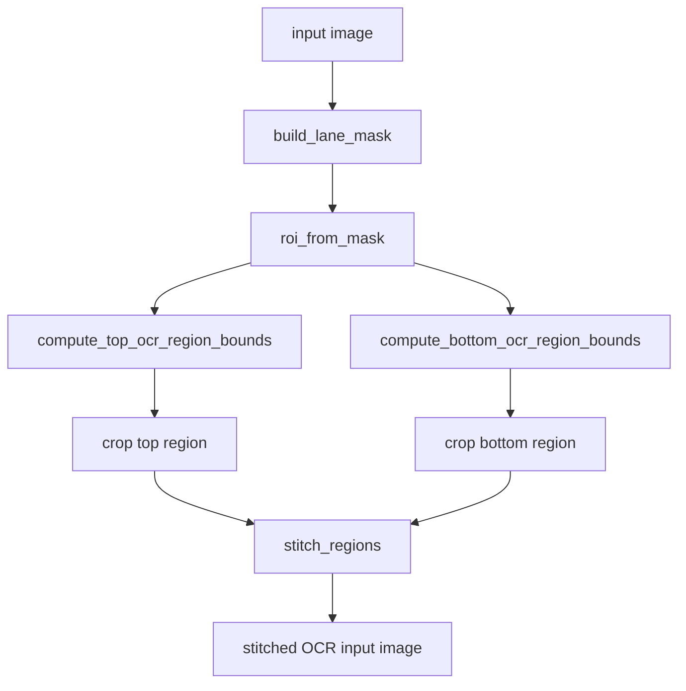
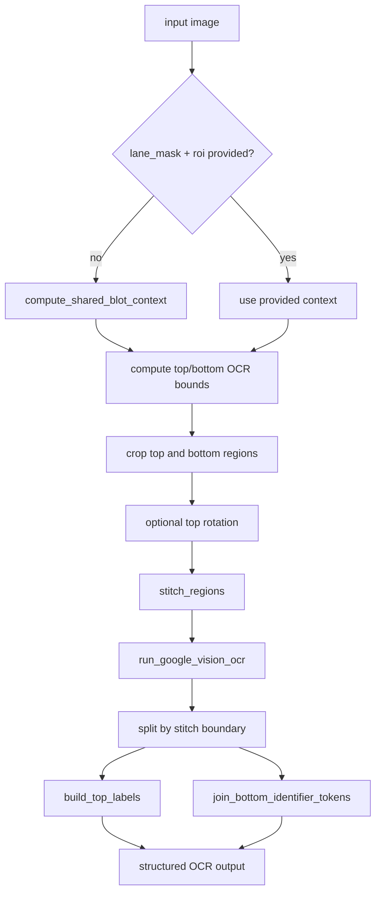
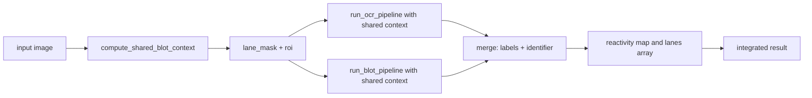

# NeoBio CV Pipeline - Design Document

High-level architecture and implementation-aligned design notes for blot analysis and OCR extraction.

## Table of Contents

1. [Overview](#overview)
2. [Architecture](#architecture)
3. [Pipeline Landscape](#pipeline-landscape)
4. [Entry Points](#entry-points)
5. [Module Responsibilities](#module-responsibilities)
6. [Pipeline Call Flows](#pipeline-call-flows)
7. [Low-Level Design (LLD)](#low-level-design-lld)
8. [Detector Registry](#detector-registry)
9. [Band Detector Configuration](#band-detector-configuration)
10. [Design Decisions](#design-decisions)
11. [Deprecated or Historical Artefacts](#deprecated-or-historical-artefacts)

---

## Overview

**Purpose**: automated blot lane/band analysis plus OCR extraction around the blot ROI.

**Core capabilities**:
1. Lane mask creation (binary segmentation)
2. ROI extraction (bounding box)
3. Lane separator detection
4. Lane box generation
5. Per-lane band detection
6. OCR strip extraction above and below ROI
7. Optional top-strip rotation and strip stitching
8. OCR extraction and structured text post-processing
9. Integrated label-to-reactivity mapping

**Primary outputs**:

Blot pipeline output:
```python
{
    "num_lanes": int,
    "band_present": list[bool],
    "lane_boxes": list[tuple[int, int, int, int]],
    "roi": tuple[int, int, int, int],
}
```

OCR pipeline output:
```python
{
    "roi": tuple[int, int, int, int],
    "top_region_bounds": tuple[int, int, int, int],
    "bottom_region_bounds": tuple[int, int, int, int],
    "stitch_boundary_y": int,
    "top_labels": list[str],
    "bottom_identifier": str,
    "top_items": list[dict],
    "bottom_items": list[dict],
    "raw_text": str,
    "stitched_image": np.ndarray,
}
```

Integrated pipeline output:
```python
{
    "identifier": str,
    "reactivity": dict[str, bool],
    "ocr": dict,
    "blot": dict,
    "lanes": list[dict],
    "meta": dict,
}
```

---

## Architecture

### Package Structure

```
src/neobio/
├── blot/
│   ├── lane_mask.py
│   ├── band_detection.py
│   └── band_detection_legacy.py
├── ocr/
│   ├── region_stitching.py
│   ├── google_vision_backend.py
│   └── ocr_postprocess.py
├── pipelines/
│   ├── shared_preprocessing.py
│   ├── blot_pipeline.py
│   ├── ocr_prep_pipeline.py
│   ├── ocr_pipeline.py
│   └── integrated_pipeline.py
└── utils/
    ├── debug_draw.py
    └── io.py
```

### Layered Design



---

## Pipeline Landscape

The repository currently has four orchestrator pipelines:

| Pipeline | Function | Scope | Cloud OCR Call |
|---|---|---|---|
| Blot | `run_blot_pipeline` | lane segmentation + band detection | No |
| OCR prep | `run_ocr_prep_pipeline` | top/bottom crop + stitch only | No |
| OCR full | `run_ocr_pipeline` | prep + OCR backend + postprocess | Yes |
| Integrated | `run_integrated_pipeline` | shared preprocess + OCR + blot + merge | Yes |

### Shared Preprocessing Strategy

`compute_shared_blot_context(image_bgr)` in `shared_preprocessing.py` computes:
- `lane_mask`
- `roi`

This is reused by both OCR and blot branches to avoid duplicate preprocessing and keep both branches aligned to identical geometry.



---

## Entry Points

### Active CLI Scripts

| Script | Pipeline Entry |
|---|---|
| `scripts/run_blot.py` | `run_blot_pipeline(...)` |
| `scripts/run_ocr_prep.py` | `run_ocr_prep_pipeline(...)` |
| `scripts/run_ocr_pipeline.py` | `run_ocr_pipeline(...)` |
| `scripts/run_integrated_pipeline.py` | `run_integrated_pipeline(...)` |
| `scripts/test_blot_batch.py` | batch wrapper around blot pipeline + debug overlay |
| `scripts/test_google_vision_ocr.py` | direct OCR backend probe |

### Script-to-Pipeline Map



---

## Module Responsibilities

### `src/neobio/pipelines/shared_preprocessing.py`

**Purpose**: central helper to compute lane mask and ROI exactly once.

**Key Function**:
- `compute_shared_blot_context(image_bgr) -> {"lane_mask": np.ndarray, "roi": tuple}`

**Design Notes**:
- Validates input image.
- Removes duplicate mask+ROI computation across branch pipelines.

### `src/neobio/blot/lane_mask.py`

**Purpose**: lane geometry and binary mask utilities.

**Key Functions**:
- `auto_grey_range(gray)`
- `build_lane_mask(image_bgr, ...)`
- `roi_from_mask(mask)`
- `find_vertical_separators(mask_roi, ...)`
- `lanes_from_separators(roi_bbox, sep_xs, ...)`

**Design Notes**:
- Returns `uint8` mask (0/255).
- Coordinates are full-image except temporary ROI-relative separator coordinates.

### `src/neobio/blot/band_detection.py`

**Purpose**: official detector implementation and runtime detector registry.

**Key Functions**:
- `longest_true_run(...)`
- `has_band_from_row_score(...)`
- `has_band_mask(...)`

**Registry**:
```python
DETECTORS = {
    "mask": has_band_mask,
}
```

### `src/neobio/blot/band_detection_legacy.py`

**Purpose**: historical/reference detector functions not wired into default runtime path.

### `src/neobio/pipelines/blot_pipeline.py`

**Purpose**: blot-only orchestration.

**Key Function**:
```python
run_blot_pipeline(
    image_bgr,
    band_mode="mask",
    *,
    lane_mask=None,
    roi=None,
    debug=False,
    debug_dir=None,
) -> dict
```

**Design Notes**:
- Accepts optional precomputed `lane_mask` and `roi`.
- Falls back to ROI-as-single-lane if no separators produce valid lanes.

### `src/neobio/pipelines/ocr_prep_pipeline.py`

**Purpose**: build stitched OCR input image without running OCR backend.

### `src/neobio/pipelines/ocr_pipeline.py`

**Purpose**: end-to-end OCR orchestration (prep + backend + postprocess).

**Key Function**:
```python
run_ocr_pipeline(
    image_bgr,
    *,
    lane_mask=None,
    roi=None,
    top_extra_bottom_px=6,
    bottom_extra_top_px=6,
    top_rotation_deg=-52.2,
    stitch_gap_px=20,
    debug=False,
    debug_dir=None,
) -> dict
```

### `src/neobio/pipelines/integrated_pipeline.py`

**Purpose**: unified branch orchestrator combining OCR and blot outputs.

**Key Function**:
```python
run_integrated_pipeline(
    image_bgr,
    *,
    ocr_top_extra_bottom_px=0,
    ocr_bottom_extra_top_px=0,
    ocr_top_rotation_deg=-52.5,
    ocr_stitch_gap_px=20,
    band_mode="mask",
    debug=False,
    debug_dir=None,
) -> dict
```

**Design Notes**:
- Calls shared preprocessing once.
- Runs OCR and blot branches with shared geometry.
- Produces:
  - `identifier` (bottom OCR token line)
  - `reactivity` (top label -> band boolean)
  - `lanes` merged lane records
  - branch-level `ocr` and `blot` payloads
  - `meta` counters and geometry metadata

### `src/neobio/ocr/region_stitching.py`

**Purpose**: OCR geometry helpers (bounds, crop, rotate, stitch).

### `src/neobio/ocr/google_vision_backend.py`

**Purpose**: Google Vision call and stable item normalization.

### `src/neobio/ocr/ocr_postprocess.py`

**Purpose**: split/group/sort/join OCR tokens into labels and identifier.

### `src/neobio/utils/debug_draw.py`

**Purpose**: draw blot overlays with ROI, lane boxes, and band labels.

### `src/neobio/utils/io.py`

**Purpose**: input listing and output directory/path helpers.

---

## Pipeline Call Flows

### 1) Blot Pipeline (`run_blot_pipeline`)



### 2) OCR Prep Pipeline (`run_ocr_prep_pipeline`)



### 3) OCR Pipeline (`run_ocr_pipeline`)



### 4) Integrated Pipeline (`run_integrated_pipeline`)



---

## Low-Level Design (LLD)

### A. Lane-Mask Transformations (`lane_mask.py`)

1. `auto_grey_range(gray)` computes adaptive threshold bounds from grayscale percentile statistics.
2. `build_lane_mask(image_bgr)` builds lane/separator mask using range thresholding and morphology.
3. `roi_from_mask(mask)` returns inclusive full-image ROI around white lane pixels.
4. `find_vertical_separators(mask_roi)` returns ROI-relative separator centers.
5. `lanes_from_separators(roi_bbox, sep_xs, pad, min_lane_width)` converts boundaries into full-image lane boxes.

### B. Band Decision (`band_detection.py`)

1. `has_band_mask(lane_mask, ...)` builds row-wise black-pixel score from cropped lane mask.
2. Smooth score vertically (`cv2.blur`) to reduce spikes.
3. `has_band_from_row_score` applies dual criterion:
   - peak criterion (`max(score) > peak_thr`)
   - run-length criterion (`longest_true_run(score > run_thr) >= min_run`)
4. Output is `peak_ok AND run_ok`.

### C. Coordinate Conventions

- Full-image coordinates: ROI and returned lane boxes.
- ROI-relative coordinates: separator x values during separator detection.
- Conversion from ROI-relative x to full-image x is explicit in lane generation.

### D. Shared Context Contract

`compute_shared_blot_context(...)` is the canonical source of lane geometry for multi-branch orchestration.

---

## Detector Registry

### Purpose

Allow detector swapping without changing orchestration code.

### Current Registration

```python
DETECTORS = {
    "mask": has_band_mask,
}
```

### Usage

CLI:
```bash
PYTHONPATH=src python scripts/run_blot.py image.jpg --band-mode mask
```

API:
```python
result = run_blot_pipeline(image, band_mode="mask")
```

### Extending

1. Implement `def my_detector(lane_mask: np.ndarray) -> bool`.
2. Register as `DETECTORS["my_mode"] = my_detector`.
3. Use with `band_mode="my_mode"`.

---

## Band Detector Configuration

`has_band_mask()` supports these parameters:

| Parameter | Type | Default | Description |
|---|---|---|---|
| `top_crop_frac` | float | 0.15 | Crop fraction from top |
| `bottom_crop_frac` | float | 0.15 | Crop fraction from bottom |
| `edge_margin_px` | int | 6 | Left/right inward margin |
| `smooth_kernel_h` | int | 9 | Vertical smoothing kernel height |
| `peak_thr` | float | 0.12 | Peak score threshold |
| `run_thr` | float | 0.08 | Run mask threshold |
| `min_run` | int | 10 | Minimum contiguous run length |

Tuning guide:
- Too many false positives: increase `peak_thr`, `run_thr`, `min_run`.
- Missing true bands: decrease `peak_thr`, `run_thr`, `min_run`.
- Separator bleed: increase `edge_margin_px`.
- Noisy row score: increase `smooth_kernel_h`.

---

## Design Decisions

### Why mask-first lane analysis

- Keeps behavior interpretable and fast.
- Maintains stable geometry for downstream OCR extraction.

### Why detector registry

- Supports runtime detector selection.
- Keeps pipeline orchestration decoupled from detector details.

### Why separate OCR prep and full OCR

- Enables backend-free debug and experimentation.
- Reduces cloud dependency when only geometry validation is needed.

### Why add shared preprocessing

- Ensures blot and OCR branches consume identical ROI/mask context.
- Avoids duplicated preprocessing work in integrated runs.

### Why integrated pipeline exists

- Produces ready-to-consume label-to-reactivity output.
- Preserves branch outputs while adding merged lane semantics.

---

## Deprecated or Historical Artefacts

The following root-level files are historical and not part of the active architecture:

- `blot_detect.py`
- `old_blot_detect.py`

They are retained only as older experimentation/reference snapshots and should not be used as entry points for current development.
