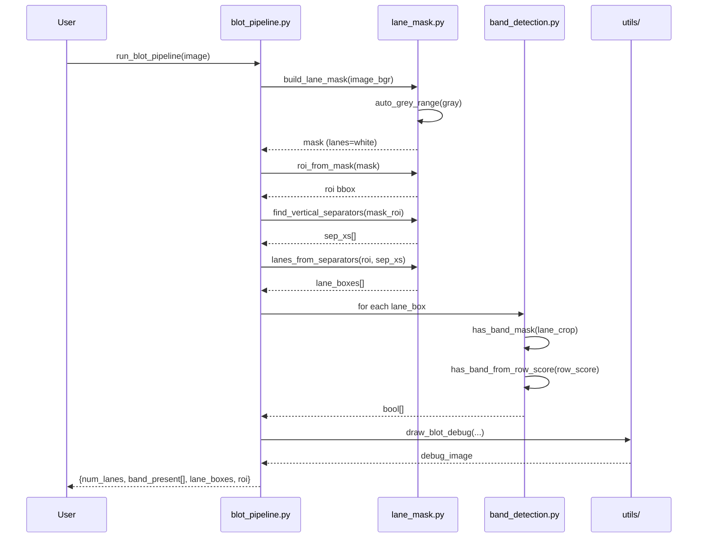

# NeoBio CV Pipeline — Design Document

High-level architecture and design decisions for the blot detection pipeline.

## Table of Contents

1. [Overview](#overview)
2. [Architecture](#architecture)
3. [Module Responsibilities](#module-responsibilities)
4. [Pipeline Call Flow](#pipeline-call-flow-from-blot_pipelinepy)
5. [Low-Level Design](#low-level-design-lld)
6. [Detector Registry](#detector-registry)
7. [OCR Pipeline Call Flow](#ocr-pipeline-call-flow)
8. [Design Decisions](#design-decisions)

---

## Overview

**Purpose**: Automated blot analysis and OCR extraction for Western blot images.

**Core Stages**:
1. Lane mask creation (binary segmentation)
2. ROI extraction (bounding box)
3. Lane separator detection (vertical lines)
4. Lane box generation (individual lane regions)
5. Per-lane band detection (binary classification)
6. OCR region extraction above and below blot ROI
7. Optional top-region rotation and region stitching
8. OCR text extraction + structured post-processing

**Output**:
```python
{
    "num_lanes": int,
    "band_present": list[bool],
    "lane_boxes": list[tuple],
    "roi": tuple
}
```

**OCR Output (full OCR pipeline)**:
```python
{
    "roi": tuple,
    "top_region_bounds": tuple,
    "bottom_region_bounds": tuple,
    "stitch_boundary_y": int,
    "top_labels": list[str],
    "bottom_identifier": str,
    "top_items": list[dict],
    "bottom_items": list[dict],
    "raw_text": str,
    "stitched_image": np.ndarray,
}
```

---

## Architecture

### Package Structure

```
src/neobio/
├── blot/                      # Core blot detection modules
│   ├── lane_mask.py           # Lane mask & ROI utilities
│   ├── band_detection.py      # MVP detector (mask-only)
│   └── band_detection_legacy.py # Legacy reference
├── ocr/                       # OCR-specific helpers
│   ├── region_stitching.py    # Bounds/crop/rotate/stitch utilities
│   ├── google_vision_backend.py # Google Vision call + response normalization
│   └── ocr_postprocess.py     # OCR token split/group/join logic
├── pipelines/                 # Pipeline orchestrators
│   └── blot_pipeline.py       # Main entry point
│   ├── ocr_prep_pipeline.py   # OCR prep only (no text extraction)
│   └── ocr_pipeline.py        # OCR prep + OCR backend + postprocess
└── utils/                     # Shared utilities
    ├── debug_draw.py          # Visualization
    └── io.py                  # File I/O helpers
```

### Layered Design

```
┌─────────────────────────────────────────┐
│         User Scripts (CLI)              │
│   run_blot.py / test_blot_batch.py      │
└──────────────────┬──────────────────────┘
                   │
┌──────────────────▼──────────────────────┐
│       Pipeline Orchestrator             │
│      blot_pipeline.py                   │
└──────────────────┬──────────────────────┘
                   │
    ┌──────────────┼──────────────┐
    │              │              │
┌───▼────┐  ┌──────▼─────┐  ┌────▼──────┐
│Lane    │  │Band        │  │Utilities  │
│Mask    │  │Detection   │  │(Draw/IO)  │
└────────┘  └────────────┘  └───────────┘
```

---

## Module Responsibilities

### `src/neobio/blot/lane_mask.py`

**Purpose**: Lane geometry and binary mask utilities.

**Key Functions**:
- `auto_grey_range(gray)` → `(low, high)`: Adaptive grey-value detection
- `build_lane_mask(image, debug, debug_out_path)` → `mask`: Binary segmentation
- `roi_from_mask(mask)` → `(x1, y1, x2, y2)`: ROI bounding box
- `find_vertical_separators(mask_roi)` → `[x_coords]`: Separator detection
- `lanes_from_separators(roi_bbox, sep_xs, pad)` → `[(x1, y1, x2, y2), ...]`: Lane boxes

**Design Notes**:
- All functions are **pure** (no I/O side effects unless `debug=True`)
- Coordinates are in **full image space** (except `mask_roi` which is ROI-relative)
- Returns uint8 mask (0/255) for compatibility with `cv2` operations

### `src/neobio/blot/band_detection.py` (MVP)

**Purpose**: Official band detector using mask-only approach.

**Key Functions**:
- `longest_true_run(b)` → `int`: Utility for run-length analysis
- `has_band_from_row_score(row_score_smooth, peak_thr, run_thr, min_run)` → `bool`: Decision logic
- `has_band_mask(lane_mask, ...)` → `bool`: MVP detector signature

**Detector Registry**:
```python
DETECTORS = {
    "mask": has_band_mask,
}
```

**Design Notes**:
- Detector signature: `(lane_mask: np.ndarray) -> bool`
- All parameters are tunable (easy MVP tuning)
- Decision rule: `peak_ok AND run_ok`

### `src/neobio/blot/band_detection_legacy.py`

**Purpose**: Reference implementations (not used by default).

**Includes**:
- `lane_has_band_from_mask()`: Original mask detector (with width check)
- `lane_has_band_from_row_score()`: Row-score decision

**Design Notes**:
- Preserved for comparison and fallback
- Not exposed in main `DETECTORS` registry
- Can be imported for research or re-enabling

### `src/neobio/pipelines/blot_pipeline.py`

**Purpose**: Main orchestrator that "weaves together" all stages.

**Key Function**:
```python
def run_blot_pipeline(image_bgr, band_mode="mask") -> dict:
```

**Orchestration Steps**:
1. Build lane mask
2. Extract ROI from mask
3. Detect vertical separators
4. Generate lane boxes
5. For each lane box:
   - Extract lane mask crop
   - Apply detector
6. Return aggregated result

**Design Notes**:
- Single entry point for all pipeline operations
- Detects band_mode early and validates
- Fallback: if no lanes detected, uses entire ROI as single lane

### `src/neobio/utils/debug_draw.py`

**Purpose**: Visualization utilities.

**Key Function**:
```python
def draw_blot_debug(image_bgr, roi, lane_boxes, band_present) -> debug_image:
```

**Rendering**:
- Green ROI box
- Green lane boxes (if band detected)
- Red lane boxes (if white/no band)
- Text labels: `"{i}: BAND"` or `"{i}: WHITE"`

### `src/neobio/utils/io.py`

**Purpose**: File I/O helpers.

**Key Functions**:
- `list_images(input_dir)` → `[paths]`: Find image files
- `ensure_dir(path)`: Create directory tree
- `default_out_path(input_path, out_dir, suffix)` → `path`: Generate output filename

### `src/neobio/ocr/region_stitching.py`

**Purpose**: OCR-region geometry helpers.

**Key Functions**:
- `compute_top_ocr_region_bounds(...)`
- `compute_bottom_ocr_region_bounds(...)`
- `crop_region(...)`
- `rotate_image_bound(...)`
- `stitch_regions(...)`

**Design Notes**:
- Rotation is intentionally separate from stitching for explicit pipeline control.
- Helpers are pure and reusable from both OCR prep and full OCR pipeline.

### `src/neobio/ocr/google_vision_backend.py`

**Purpose**: External OCR backend integration.

**Key Functions**:
- `run_google_vision_ocr(image_bgr)`
- `_normalise_text_annotations(...)`
- `_bbox_vertices_to_list(...)`

**Design Notes**:
- Encodes image in memory to avoid temporary disk I/O.
- Raises explicit errors on encode failure and API-reported failure.
- Converts API objects to a stable internal schema (`text`, `bbox`, extents, centers).

### `src/neobio/ocr/ocr_postprocess.py`

**Purpose**: Convert OCR token items to usable labels/identifiers.

**Key Functions**:
- `split_items_by_stitch_boundary(...)`
- `group_top_items_by_line(...)`
- `sort_items_left_to_right(...)`
- `join_tokens_with_spaces(...)`
- `join_bottom_identifier_tokens(...)`
- `build_top_labels(...)`

**Design Notes**:
- Uses token center-y (`cy`) to split top and bottom text regions.
- Derives line-grouping threshold from median token height when not provided.
- Uses punctuation-aware bottom-token joining for identifiers like `NKX2.1/15721`.

### `src/neobio/pipelines/ocr_prep_pipeline.py`

**Purpose**: Build stitched OCR input image only.

**Design Notes**:
- Deliberately does not call OCR backend.
- Used for debugging, data prep, and backend-independent OCR experiments.

### `src/neobio/pipelines/ocr_pipeline.py`

**Purpose**: End-to-end OCR orchestrator.

**Design Notes**:
- Reuses low-level lane-mask and ROI helpers.
- Does not call `run_blot_pipeline` (keeps OCR flow independent).
- Returns both final text fields and intermediate token items for debugging.

---

## Pipeline Call Flow (from `blot_pipeline.py`)

This section documents the exact logical sequence discussed in implementation review, with function-level inputs/outputs.

### Single Image Processing (Authoritative Flow)

```
image_bgr (H×W×3)
        │
        ├─ lane_mask = build_lane_mask(image_bgr)
        │      input : BGR image
        │      output: uint8 mask (0/255), lanes=white, separators/bands=black
        │
        ├─ roi = roi_from_mask(lane_mask)
        │      input : full mask
        │      output: (x1, y1, x2, y2) in full-image coordinates
        │
        ├─ mask_roi = lane_mask[y1:y2+1, x1:x2+1]
        │      input : full mask + ROI bbox
        │      output: ROI-relative mask
        │
        ├─ sep_xs = find_vertical_separators(mask_roi)
        │      input : ROI mask (lanes white, separators black)
        │      output: sorted separator x-centers in ROI coordinates
        │
        ├─ lane_boxes = lanes_from_separators(roi, sep_xs, pad=3, min_lane_width=12)
        │      input : ROI bbox + separator centers
        │      output: [(x1, y1, x2, y2), ...] in full-image coordinates
        │
        ├─ For each lane box:
        │      lane_crop = lane_mask[ly1:ly2+1, lx1:lx2+1]
        │      band = DETECTORS[band_mode](lane_crop)
        │
        └─ return {
                     "num_lanes": len(lane_boxes),
                     "band_present": [bool, ...],
                     "lane_boxes": lane_boxes,
                     "roi": roi,
             }
```

### Batch Processing

```
input folder
        │
        └─ for each image:
                 load → run_blot_pipeline → draw_blot_debug → save overlay
```

### Sequence Diagram



---

## Low-Level Design (LLD)

### A. `lane_mask.py` Data Transformations

#### 1) `auto_grey_range(gray) -> (grey_low, grey_high)`

- Input: grayscale image (`uint8`, shape H×W)
- Operation:
    1. Keep candidate pixels in `[165, 245]`
    2. Fallback to `(165, 230)` if candidate count is too small (`<1000`)
    3. Compute `lo = p10`, `hi = p95`
    4. Expand range with asymmetric safety margins:
         - `grey_low = int(max(0, lo - 15))`
         - `grey_high = int(min(245, hi + 5))`
- Output: adaptive threshold pair for mask creation

Design rationale:
- Percentiles reduce sensitivity to outliers.
- Dark-side padding is larger to include faint lane regions.
- Upper clamp at `245` avoids pure-white background bleed.

#### 2) `build_lane_mask(image_bgr, debug=False, debug_out_path=None) -> mask`

- Input: BGR image
- Operation:
    1. Convert to grayscale
    2. Call `auto_grey_range`
    3. `cv2.inRange(gray, grey_low, grey_high)`
    4. Morphological open (remove tiny white specks)
    5. Invert (separators become white)
    6. Vertical close with kernel `(1, k_sep_y)` to connect broken separators
    7. Dilate to thicken separators
    8. Invert back (lanes white)
- Output: binary mask (`255` lane regions, `0` separators/background)

#### 3) `roi_from_mask(mask) -> (x1, y1, x2, y2)`

- Input: binary mask
- Operation: find min/max x and y over white pixels (`mask > 0`)
- Output: smallest inclusive full-image bounding box of lane region

#### 4) `find_vertical_separators(mask_roi, min_height_frac=0.80, max_width_px=12) -> List[int]`

- Input: ROI mask (lanes white, separators black)
- Operation:
    1. Binarize and invert so separators are white
    2. Vertical morphological open with `(3, k_h)` where `k_h ≈ 0.9 * ROI height`
    3. `cv2.findContours(..., RETR_EXTERNAL, CHAIN_APPROX_SIMPLE)` to get connected white blobs
    4. For each contour, bounding box filter:
         - tall enough: `hh >= min_height_frac * h`
         - narrow enough: `ww <= max_width_px`
    5. Store separator center `x + ww // 2`
    6. Sort ascending
- Output: ROI-relative separator center x-coordinates

Design rationale:
- Midpoint representation is intentionally minimal: only x-boundary location is needed for lane partitioning.

#### 5) `lanes_from_separators(roi_bbox, sep_xs, pad=3, min_lane_width=12) -> List[Tuple[int,int,int,int]]`

- Input:
    - `roi_bbox` in full-image coordinates
    - `sep_xs` in ROI coordinates
- Operation:
    1. Build boundaries: `[0] + sep_xs + [roi_w - 1]`
    2. Slice each consecutive interval as a lane candidate
    3. Apply inward padding (`left+pad`, `right-pad`) to avoid separator columns
    4. Skip lanes narrower than `min_lane_width`
    5. Convert ROI x back to full-image x:
         - `lane_x1 = roi_x1 + lx`
         - `lane_x2 = roi_x1 + rx`
    6. Append `(lane_x1, roi_y1, lane_x2, roi_y2)`
- Output: lane boxes in full-image coordinate space

Design rationale:
- Midpoint-to-midpoint slicing can include separator columns; `pad` is the explicit guard against this.

### B. `band_detection.py` Decision Pipeline

#### 1) `has_band_mask(lane_mask, ...) -> bool`

- Input: one lane mask crop (`uint8`, lanes mostly white)
- Operation:
    1. Validate width and crop bounds
    2. Crop top/bottom and side margins
    3. Convert black pixels to band candidates: `band_pix = (trim == 0)`
    4. Compute row-wise score: `row_score = mean(band_pix, axis=1)`
    5. Smooth score vertically: `cv2.blur(..., (1, smooth_kernel_h))`
    6. Call `has_band_from_row_score(...)`
- Output: lane-level boolean prediction

#### 2) `has_band_from_row_score(row_score_smooth, peak_thr, run_thr, min_run) -> bool`

- Input: smoothed row profile (`0..1`)
- Operation:
    - `peak_ok = max(row_score_smooth) > peak_thr`
    - `run_ok = longest_true_run(row_score_smooth > run_thr) >= min_run`
    - return `peak_ok and run_ok`
- Output: robust binary decision

Design rationale:
- Peak criterion enforces sufficient signal strength.
- Run-length criterion rejects narrow/noisy spikes.
- Combined rule improves robustness over a single threshold.

### C. Coordinate Conventions (Critical for Correctness)

- Full-image coordinates: ROI and final lane boxes.
- ROI-relative coordinates: separator detection (`sep_xs`).
- Conversion step is explicit in `lanes_from_separators` before returning lane boxes.

### D. Why the Current Workflow is Kept

- Separator centers are simpler than full contour geometry for partitioning lanes.
- Padding near separators controls contamination by black separator columns.
- Mask-only band detection stays interpretable and fast for MVP behavior.

---

## Detector Registry

### Purpose

Allow easy swapping of band detectors without changing pipeline code.

### Registration

```python
# src/neobio/blot/band_detection.py
DETECTORS = {
    "mask": has_band_mask,
}
```

### Usage

**CLI**:
```bash
PYTHONPATH=src python scripts/run_blot.py image.jpg --band-mode mask
```

**API**:
```python
result = run_blot_pipeline(image, band_mode="mask")
```

### Adding New Detector

1. Define function:
   ```python
   def my_detector(lane_mask: np.ndarray) -> bool:
       # Must return True or False
       pass
   ```

2. Register:
   ```python
   DETECTORS["my_mode"] = my_detector
   ```

3. Use immediately:
   ```bash
   PYTHONPATH=src python scripts/run_blot.py image.jpg --band-mode my_mode
   ```

---

## OCR Pipeline Call Flow

This flow documents `run_ocr_pipeline(...)` end-to-end:

1. Validate input image and numeric parameters.
2. Build lane mask and ROI (`build_lane_mask` → `roi_from_mask`).
3. Compute top and bottom OCR bounds from ROI.
4. Crop top and bottom regions from original image.
5. Rotate top crop if rotation angle is non-zero (`rotate_image_bound`).
6. Stitch rotated top and bottom with configurable white gap (`stitch_regions`).
7. Compute stitch boundary y-coordinate from rotated-top height.
8. Run OCR backend on stitched image (`run_google_vision_ocr`).
9. Split OCR items into top/bottom groups by stitch boundary and gap.
10. Build top labels and bottom identifier (`build_top_labels`, `join_bottom_identifier_tokens`).
11. Optionally save numbered debug artefacts.
12. Return structured OCR dictionary with geometry, text outputs, token items, and stitched image.

---

## Design Decisions

### Why Mask-Only (MVP)?

**Pros**:
- Simpler logic (no grayscale interpretation needed)
- Fewer hyperparameters
- More interpretable (binary mask = clear black/white regions)
- Faster (no Otsu thresholding per lane)

**Cons**:
- Less flexible for edge cases
- No intensity information used

**Decision**: MVP prioritizes simplicity and robustness; can add grayscale detector later.

### Why Binary ROI Instead of Multi-Stage?

**Decision**: Simple pipeline chosen because:
- Task is well-constrained (lanes are vertical)
- Binary mask + morphology is fast and interpretable
- Scales to large batches

### Why Detector Registry Pattern?

**Rationale**:
- Easy to add new detectors without modifying pipeline
- CLI users can select modes at runtime
- Research-friendly (compare detectors)

### Why Keep OCR Pipelines Separate?

**Decision**:
- Keep `ocr_prep_pipeline` and `ocr_pipeline` separate.

**Rationale**:
- Allows running geometry/debug prep without cloud OCR calls.
- Makes OCR backend integration swappable and easier to test.
- Keeps blot lane/band logic independent from OCR concerns.

### Why Return OCR Token Items?

**Decision**:
- Return `top_items` and `bottom_items` in OCR output.

**Rationale**:
- Speeds up debugging of boundary split and line-grouping behavior.
- Supports future overlay visualizations and confidence-based filters.

### Parameter Defaults

**Philosophy**: Make defaults work for typical Western blots, but allow tuning.

**Strategy**:
- Conservative defaults (lower thresholds)
- Document each parameter
- Easy override in API/CLI
